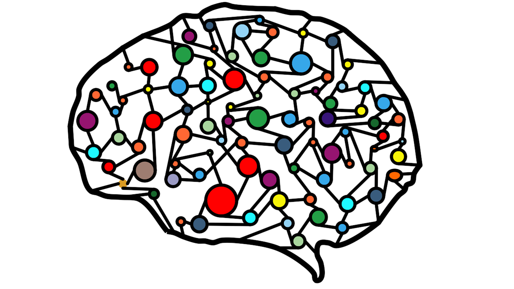

# Redes Neuronales

Señales y Sistemas



## Autores

- Jordi Blasco
- Maria Mestre
- Alejandro Operé
- Sara Mora
- Elena Fernández

19/03/2025

# Ingeniería en Inteligencia Artificial

# Introducción

Las redes neuronales son modelos computacionales inspirados en el funcionamiento del cerebro humano. Su estructura está compuesta por neuronas artificiales organizadas en capas interconectadas que procesan información de manera similar a como lo hacen las neuronas biológicas. A través de un proceso de ajuste de pesos y conexiones, estas redes pueden aprender patrones complejos a partir de datos, permitiéndoles mejorar su desempeño en distintas tareas.

Existen diferentes tipos de redes neuronales, cada una diseñada para tareas específicas. Las redes neuronales artificiales son las más básicas y pueden resolver problemas generales de clasificación y predicción. Las redes convolucionales son especialmente efectivas en el procesamiento de imágenes, mientras que las redes recurrentes son ideales para trabajar con datos secuenciales, como el texto o el reconocimiento de voz.

Gracias a su capacidad de aprender de los datos y adaptarse a distintos escenarios, las redes neuronales han revolucionado el campo de la Inteligencia Artificial, impulsando avances tecnológicos que han transformado la forma en que se interactúa con la tecnología y la información.

El objetivo de la siguiente práctica documentada es estudiar la creación y entrenamiento de redes neuronales, así como el procesamiento de imágenes para su clasificación y predicción sobre su pertenencia a ciertas categorías.

# Parte 1: Creación de una Red Neuronal

En esta primera parte de la práctica, se ha implementado un modelo de red más sencillo para aprender el funcionamiento antes de crear una idea propia de red. Se tratará la creación de una red neuronal convolucional (CNN) cuyo objetivo consiste en la identificación de 6 formas diferentes geométricas: círculo, cometa, paralelogramo, cuadrado, trapecio y triángulo. Para ello, se entrenará esta red neuronal basándose en una estructura de dataset (2DgeometricShapesData.zip) en la que se incorporará tanto datos de entrenamiento, validación y prueba, los cuales se recogen en carpetas que a su vez incorporan subcarpetas con las categorías geométricas.

El modelo a crear consta de tres bloques convolucionales con un número creciente de filtros (8 → 16 → 32), cada uno seguido de normalización por lotes, activación ReLU y max pooling. Además, las capas finales incluirán una capa totalmente conectada (fully-connected), activación softmax y salida de clasificación. Para ello, se definirá la arquitectura de la red neuronal, así como se especificará las opciones de entrenamiento mediante el optimizador Stochastic Gradient Descent with Momentum (SGDM) con una tasa de aprendizaje inicial de 0.01 durante 4 épocas. Esto se explicará en detalle en el momento de su implementación.

## 1. Red de Detección de Formas Geométricas

### a. Implementación del código

En primer lugar, en este fragmento de código, la función `gpuDeviceCount` se utiliza para verificar cuántas GPUs compatibles con CUDA están disponibles. Si hay al menos una GPU disponible el código intentará activarla para el entrenamiento de la red seleccionando la primera, si se produce un error en lugar de detener el programa capturará el error y cambiará a CPU. Si no hay ninguna GPU disponible se selecciona directamente la CPU para procesar el programa. Esto se debe a que la GPU permite realizar cálculos de manera más eficaz que una CPU, ya que aprovecha el procesamiento paralelo de tareas gracias a la mayor cantidad de núcleos que incorpora. Además, el uso de la GPU es especialmente beneficioso en aplicaciones como el entrenamiento de redes neuronales profundas, donde se requieren operaciones matriciales intensivas. En caso de que no haya una GPU disponible, el entrenamiento se lleva a cabo en la CPU, aunque con tiempos de ejecución considerablemente mayores.

```matlab
clear; clc; close all;
%% Verificar disponibilidad de CUDA (GPU)
if gpuDeviceCount > 0
    try
        gpuDevice(1); % Selecciona la GPU 1
        executionEnv = 'gpu';
        fprintf('Dispositivo CUDA detectado. Se usará GPU para entrenamiento y pruebas.\n');
    catch ME
        executionEnv = 'cpu';
        fprintf('Error al intentar usar CUDA; %s\nSe usará CPU para entrenamiento y pruebas.\n', ME.message);
    end
else
    executionEnv = 'cpu';
    fprintf('No se detectó dispositivo CUDA. Se usará CPU para entrenamiento y pruebas.\n');
end
```

Posteriormente, y debido a que una vez entrenado el modelo se guarda en `trained2Dgeometricshapes.mat` para usos futuros, se comprueba si ya existe este modelo entrenado para cargarlo. En caso contrario, se verifica que las carpetas `train`, `val` y `test` existan, puesto que si ya se encuentran en el directorio correspondiente no es necesario descomprimir el zip original que recoge todos los datos. Sin embargo, si estas carpetas no existen, si se descomprime el ZIP, comprobando previamente que exista y lanzando un error en caso negativo. Ahora, se crean los tres datastores para el entrenamiento, validación y prueba mediante una función incorporada en MATLAB, concretamente en la Deep Learning Toolbox, llamada `imageDatastore`, que permite organizar las imágenes entre estas carpetas sin consumir mucha memoria; incluyendo subcarpetas (`'IncludeSubfolders', true`) y asignando etiquetas de manera automática según los nombres de las carpetas (`'LabelSource', 'foldernames'`).

```matlab
%% COMPROBAR SI YA EXISTE EL MODELO ENTRENADO
if isfile('trained2Dgeometricshapes.mat')
    load('trained2Dgeometricshapes.mat', 'net');
    fprintf('Modelo entrenado encontrado y cargado desde trained2Dgeometricshapes.mat\n');
else
    %% Verificar si las carpetas ya existen
    if exist(trainFolder, 'dir') && exist(valFolder, 'dir') && exist(testFolder, 'dir')
        fprintf('Las carpetas "train", "val" y "test" ya existen. No se descomprime 2DgeometricShapesData.zip.\n');
    else
        if exist('2DgeometricShapesData.zip', 'file')
            fprintf('Extrayendo 2DgeometricShapesData.zip...\n');
            unzip('2DgeometricShapesData.zip'); % Extrae el contenido del ZIP en el directorio actual
    else
        error('No se encontró 2DgeometricShapesData.zip. Colócalo en el directorio actual.');
    end
    end
    %% Crear datastores para entrenamiento, validación y prueba
    imdsTrain = imageDatastore(trainFolder, 'IncludeSubfolders', true, 'LabelSource', 'foldernames');
    imdsVal = imageDatastore(valFolder, 'IncludeSubfolders', true, 'LabelSource', 'foldernames');
    imdsTest = imageDatastore(testFolder, 'IncludeSubfolders', true, 'LabelSource', 'foldernames');
```

A continuación, a modo de visualizar algunas de las imágenes propuestas para su entrenamiento, se crea una nueva figura para mostrarlas. Según el número de estas imágenes a representar, se organizan los gráficos de manera dinámica y automática gracias a `tiledlayout('flow')`. Para no condicionar la muestra, se seleccionan las imágenes aleatoriamente, obteniendo como máximo 20 y como mínimo el total de archivos que se encuentren en la carpeta destinada para el entrenamiento `numel(imdsTrain.Files)`, en caso de que no se disponga de tantas. Es por ello por lo que también se genera un vector de índices aleatorios de las imágenes `randperm(numel(imdsTrain.Files), numImages)`. Ahora simplemente se realiza un bucle `for` que las recorra y muestre, de manera que por cada imagen se cree una nueva subventana `nexttile` donde cargar la imagen que corresponda al índice aleatorio generado anteriormente `imread(imdsTrain.Files{perm(i)})`. Mediante `imshow(img)` se muestra la imagen, a la que se añade un título con la etiqueta de esta `title(string(imdsTrain.Labels(perm(i))))`.

```matlab
%% Visualizar algunas imágenes de entrenamiento
figure;
tiledlayout('flow');
numImages = min(20, numel(imdsTrain.Files));
perm = randperm(numel(imdsTrain.Files), numImages);
for i = 1:numImages
    nexttile;
    img = imread(imdsTrain.Files{perm(i)});
    imshow(img);
    title(string(imdsTrain.Labels(perm(i))));
end
```

Es hora de, como se ha comentado, definir la arquitectura de la CNN para la clasificación de imágenes. Bien, primero se obtienen las categorías distintivas dentro del dataset de entrenamiento, contando cuántas hay, lo que se usará en la última capa de la red con el fin de definir el número de salidas. Ahora, se define la capa de entrada con el tamaño de la imagen calculado anteriormente `imgSize`. Esta capa de entrada es la que actúa como entrada para las imágenes en la red `imageInputLayer(imgSize)`. Se aplica la primera capa convolucional `convolution2dLayer(3, 8, 'Padding' 'same')`, un filtro de tamaño 3x3 con 8 mapas de características (número de filtros) para extraerlas, asegurando que el tamaño de salida coincida con el de entrada. Cada uno de estos 8 filtros extrae una característica diferente, como puede ser bordes o texturas. Por ejemplo, si se tiene por entrada una imagen de tamaño 224 x 224 x 3, se le aplican 8 filtros de 3 x 3 extrayendo propiedades importantes y obteniendo como salida un tamaño 224x224x8. Para acelerar el entrenamiento, se normalizan las activaciones con `batchNormalizationLayer` después de la convolución, y `reluLayer` consiste en una función de activación ReLU para introducir no linealidad en la red y evitar problemas de gradiente. Después, se aplica la primera capa de max-pooling `maxPooling2dLayer(2, 'Stride', 2)` para reducir la dimensión espacial a la mitad de las características ya extraídas por la convolución anterior, eso sí, manteniendo aquellas importantes usando el valor máximo dentro de una ventana 2 x 2. para la clasificación de imágenes. Esto usa un tamaño de filtro 2 con un paso Stride también de 2, moviendo la ventana de pooling de 2 en 2 píxeles, reduciendo la dimensión a la mitad.

Por ejemplo, en la matriz anterior 4x4 de características, aplicando Max Pooling con 2x2 y Stride 2:

```
[[1,3],[5,6]]=6
[[2,4],[1,2]]=4
[[8,9],[2,7]]=9
[[4,3],[5,6]]=6
```

Se obtiene como resultado la siguiente matriz, reduciéndose de 4 x 4 a 2 x 2:

```
[[6,4],[9,6]]
```

Por lo que si la entrada es 224 x 224 x 8, tras el pooling mencionado será 112 x 112 x 8, consumiendo menos memoria y parámetros, es decir, una red más eficiente y rápida.

A continuación, se vuelve a aplicar una capa convolucional, aunque esta vez con 16 filtros, para luego volver a pasar un maxPooling como el recién comentado, y de nuevo otra capa convolucional de 32 filtros seguida de `batchNormalization` y ReLU. Así, se van extrayendo características cada vez más complejas a medida que se avanza en la red. En el ejemplo anterior, tras aplicar todas estas capas se obtendría un tamaño de 56 x 56 x 32.

Esto no es todo, sino que por último se aplica una última capa fully-connected que conecta las características extraídas a tantas neuronas como clases haya (6 en este caso), permitiendo convertirlas en predicciones. Por ejemplo, si la última capa convolucional devuelve un tensor de características 56 x 56 x 32, antes de pasarlo por esta capa, los valores se aplanan en un vector unidimensional 1000352, que consiste en el resultado de la multiplicación de las tres dimensiones. La capa fully-connected asocia esta cantidad de valores a las distintas salidas. Aún más, `softmaxLayer` es una capa de activación que convierte los valores de la fully-connected en probabilidades para cada una de las categorías/clases, cumpliendo con el axioma fundamental de la probabilidad, es decir, que todas ellas suman 1, eligiendo la clase con mayor valor en su predicción.

Por ejemplo, si antes de aplicar softmax se tiene en el vector unidimensional:

```
z = [2.0, 1.0, 0.1]
```

Se calcula, mediante la fórmula matemática:

```
S(z_i) = e^{z_i} / \sum_{j=1}^{numClasses} e^{z_j}
```

Siendo `z_i` la entrada de la neurona `i` en la capa fully-connected, se obtendría una salida final de:

```
[0.659, 0.242, 0.099]
```

Con una predicción de la clase 1 con un 65.9%. Seguidamente, se aplica una última capa `classificationLayer` que compara la predicción anterior con la etiqueta real y calcula el error/pérdida durante el entrenamiento.

```matlab
%% Definir la arquitectura de la red neuronal
numClasses = numel(categories(imdsTrain.Labels));
layers = [
    imageInputLayer(imgSize)
    convolution2dLayer(3,8, 'Padding', 'same')
    batchNormalizationLayer
    reluLayer
    maxPooling2dLayer(2, 'Stride', 2)
    convolution2dLayer(3,16, 'Padding', 'same')
    batchNormalizationLayer
    reluLayer
    maxPooling2dLayer(2, 'Stride', 2)
    convolution2dLayer(3,32, 'Padding', 'same')
    batchNormalizationLayer
    reluLayer
    fullyConnectedLayer(numClasses)
    softmaxLayer
    classificationLayer];
```

De todas formas, la estructura de la red es un concepto complejo que se abordará de manera más general en un siguiente apartado, que de hecho introducirá la siguiente red sobre la detección de tumores.

Es turno de definir las opciones de entrenamiento para una red neuronal con `trainingOptions`. Para implementar un algoritmo de optimización que actualice los pesos de la red, se usa `'sgdm'` (Stochastic Gradient Descent with Momentum) que es una versión mejorada del descenso de gradiente estocástico (SGD) que usa un término de momentum para evitar oscilaciones y mejorar la convergencia. También, resulta interesante especificar la tasa de aprendizaje que permite definir la velocidad de ajuste de los pesos en cada iteración. Debido a su delicadeza con los valores a tomar, algunos de ellos típicos son 0.01, 0.001 y 0.1. Se usa el primero de estos por ser considerado moderado y útil en muchos casos y enfoques. Además, se recorre el conjunto de datos por completo durante el entrenamiento, en total 4 épocas.

Más allá, y a modo de evitar patrones en los datos que condicionen el análisis de la precisión, se mezclan los datos de entrenamiento en cada una de las épocas mediante `'Shuffle', 'every-epoch'`. Se especifica el conjunto de validación `'ValidationData'`, `imdsVal`, que hace que durante el entrenamiento el modelo evalúe su rendimiento en este conjunto para detectar sobreajuste. Esta validación se hará cada cierta frecuencia que se especifique en `'ValidationFrequency'`, en nuestro caso 30, por lo que se realice cada 30 iteraciones, permitiendo un entrenamiento más rápido sin tener por qué validar en cada iteración, lo que podría ser demasiado costoso en recursos.

Después, para graficar el entrenamiento, se muestra una ventana en la que se aprecie la evolución del error y la precisión durante este proceso, observando si el modelo mejora o no. Para su correcta visualización, se indica `'Plots', 'training-progress'`. Si se desea recibir información detallada en la consola de MATLAB, se puede establecer true en `'Verbose'`, mientras que con false, en nuestro caso, solo se muestran los gráficos. Para definir si este entrenamiento se ejecuta en CPU o GPU, se hace uso de la variable `executionEnv`, que contiene `'gpu'` o `'cpu'`. Como se ha comentado al principio, si hay una GPU compatible, MATLAB la usará para acelerar el entrenamiento.

```matlab
%% Especificar las opciones de entrenamiento
options = trainingOptions('sgdm', ...
    'InitialLearnRate',0.01, ...
    'MaxEpochs',4, ...
    'Shuffle','every-epoch', ...
    'ValidationData', imdsVal, ...
    'ValidationFrequency',30, ...
    'Plots','training-progress', ...
    'Verbose',false, ...
    'ExecutionEnvironment', executionEnv);
```

Ahora sí, ya se puede entrenar la red neuronal usando la función `trainNetwork` que recibe `imdsTrain`, datastore de imágenes de entrenamiento; `layers`, arquitectura de la red neuronal definida; y `options`, opciones de entrenamiento configuradas. Esto permite que MATLAB recorra todas las imágenes ajustando los pesos de la red según las pérdidas y errores en la predicción. Tras su entrenamiento, se guarda el modelo entrenado para usos futuros en un archivo `trained2Dgeometricshapes.mat`, lo que elimina la necesidad de volver a entrenar la red cada vez que se vaya a usar.

```matlab
%% Entrenar la red neuronal
fprintf('Entrenando la red neuronal...\n');
net = trainNetwork(imdsTrain, layers, options);
%% Guardar el modelo entrenado para usos futuros
save('trained2Dgeometricshapes.mat', 'net');
fprintf('Modelo entrenado guardado en trained2Dgeometricshapes.mat\n');
end
```

Una vez entrenada la red, se prepara el modelo entrenado para realizar predicciones sobre imágenes del conjunto test. Para ello, en primer lugar se comprueba la existencia del datastore para el conjunto de test. Después, se obtiene el tamaño de la imagen entrenada esperada por la red neuronal `net.Layers(1).InputSize`, garantizando que las imágenes de prueba tengan el tamaño adecuada para pasarlas al modelo. A continuación, se extraen las categorías de las etiquetas de las imágenes (círculos, cometas, cuadrados, etc.), almacenándose en la variable `classNames` que recoge los nombres de las clases con las que el modelo trabajará.

```matlab
%% Crear datastore para el conjunto de test (si no existe)
if ~isfolder(testFolder)
    error('La carpeta test no se encontró.');
end
imdsTest = imageDatastore(testFolder, 'IncludeSubfolders', true, 'LabelSource', 'foldernames');
%% Probar el modelo en 15 imágenes aleatorias del conjunto de test
fprintf('\nRealizando pruebas en 15 imágenes aleatorias del conjunto de test\n');
inputSize = net.Layers(1).InputSize;
classNames = categories(imdsTest.Labels);
```

En el siguiente paso, se seleccionan 15 imágenes aleatorias del conjunto de `imdsTest`, generando 15 números aleatorios únicos entre 1 y el número total de imágenes en el conjunto de test, los cuales se almacenan en la variable `perm` indicando así las que serán seleccionadas. Estas imágenes se recorren para cargarlas desde el datastore `imdsTest` y para luego ser redimensionadas de manera que coincidan con el tamaño de entrada de la red neuronal `inputSize`. Para esto no es necesario considerar los canales de color, por lo que solo se adoptan las dos primeras dimensionar altura y ancho.

Para realizar la predicción, se pasa la imagen redimensionada por la red neuronal `net`, devolviendo el vector `scores` con las probabilidades de cada clase, como se ha explicado anteriormente. Como interesa encontrar el valor más alto en `scores`, que coincide con la mayor probabilidad, se obtiene tanto este valor máximo `max(scores)` como el índice `idx` que contiene la posición del vector de la clase con esta probabilidad, el cual se usará para convertirlo en la etiqueta correspondiente usando `classNames(idx)`. De esta manera, la red neuronal predice la categoría con la mayor probabilidad, la cual hay que comparar con la etiqueta real `trueLabel = imdsTest.Labels(perm(i))`. Esto permite verificar si la predicción es correcta, obteniendo `'OK'` cuando se cumple `predictedLabel == trueLabel`; y `'FAIL'` en caso contrario. De hecho, se imprimen los resultados en la consola correspondientes con el número de la imagen actual, la etiqueta predicha `predictedLabel`, la confianza en la predicción `maxScore*100` en porcentaje y el estado (`'OK'` o `'FAIL'`).

```matlab
numTestImages = 15;
perm = randperm(numel(imdsTest.Files), numTestImages);
for i = 1:numTestImages
    img = imread(imdsTest.Files(perm(i)));
    % Redimensionar la imagen al tamaño esperado por la red
    imgResized = imresize(img, inputSize(1:2));
    % Realizar la predicción y obtener los scores
    scores = predict(net, imgResized);
    [maxScore, idx] = max(scores);
    predictedLabel = classNames(idx);
    % Obtener la etiqueta real del datastore
    trueLabel = imdsTest.Labels(perm(i));
    % Verificar si la predicción es correcta
    if predictedLabel == trueLabel
        status = 'OK';
    else
        status = 'FAIL';
    end
    % Imprimir la etiqueta predicha, la confianza y el estado
    fprintf('Imagen %d: Etiqueta predicha: %s, Confianza: %.2f%%, %s\n', ...
        i, string(predictedLabel), maxScore*100, status);
end
```

Por último, se prueba el modelo en todas las imágenes del conjunto de test, calculando la precisión total en lugar de solo probar con 15 imágenes aleatorias. Es por ello por lo que se recorren todas las imágenes `numel(imdsTest.Files)`, se redimensiona al tamaño esperado y se realiza la predicción tal y como se ha descrito antes, de manera que si la predicción es correcta se aumenta en 1 un contador total de precisiones correctas `correctPredictions`. La precisión en porcentaje se calcula con el cociente de estas predicciones correctas entre el total de imágenes multiplicado por 100, mostrando el resultado.

```matlab
%% Probar el modelo en todas las imágenes del conjunto de test
fprintf('\nRealizando pruebas en todas las imágenes del conjunto de test:\n');
inputSize = net.Layers(1).InputSize;
classNames = categories(imdsTest.Labels);
numTestImages = numel(imdsTest.Files);
correctPredictions = 0;
for i = 1:numTestImages
    img = imread(imdsTest.Files(i));
    % Redimensionar la imagen al tamaño esperado por la red
    imgResized = imresize(img, inputSize(1:2));
    % Realizar la predicción y obtener los scores
    scores = predict(net, imgResized);
    [maxScore, idx] = max(scores);
    predictedLabel = classNames(idx);
    % Obtener la etiqueta real del datastore
    trueLabel = imdsTest.Labels(i);
    % Verificar si la predicción es correcta y sumar si es así
    if predictedLabel == trueLabel
        correctPredictions = correctPredictions + 1;
    end
end
% Calcular y mostrar la precisión total
accuracy = (correctPredictions / numTestImages) * 100;
fprintf('Accuracy total en el conjunto de test: %.2f%%\n', accuracy);
```

### b. Muestra de ejecución

A continuación, se puede observar una gráfica que corresponde con el progreso de entrenamiento de la red neuronal. El entrenamiento se completó tras alcanzar el número máximo de épocas (4 de 4), con un total de 280 iteraciones (70 por época) y una tasa de validación del 97.13%, lo que indica un alto rendimiento del modelo. El proceso tuvo una duración de 37 segundos (elapsed time), lo que sugiere una ejecución eficiente. La validación se realizó cada 30 iteraciones, permitiendo un monitoreo frecuente del desempeño. Además, se utilizó una tasa de aprendizaje constante de 0.01, lo que pudo contribuir a la estabilidad del entrenamiento.


El modelo se ejecutó en CPU debido a la ausencia de un dispositivo CUDA, pero aun así logró una precisión total del 98.27% en el conjunto de prueba, lo que indica un rendimiento sólido. En una prueba con 15 imágenes aleatorias, el modelo tuvo un alto nivel de confianza en la mayoría de sus predicciones, alcanzando el 100% en varios casos. Sin embargo, hubo un fallo en la imagen 6, donde la etiqueta predicha "trapezoid" tuvo una confianza del 98.99%, lo que sugiere que, aunque el modelo es preciso, puede presentar errores ocasionales incluso con altos niveles de confianza. A pesar de que la ejecución en CPU no parece haber afectado significativamente la precisión del modelo, su desempeño podría mejorar, como se ha mencionado, con aceleración GPU.

```txt
No se detectó dispositivo CUDA. Se usará CPU para entrenamiento y pruebas.
Modelo entrenado encontrado y cargado desde trained2Dgeometricshapes.mat
Realizando pruebas en 15 imágenes aleatorias del conjunto de test:
Imagen 1: Etiqueta predicha: square, Confianza: 100.00%, OK
Imagen 2: Etiqueta predicha: square, Confianza: 99.90%, OK
Imagen 3: Etiqueta predicha: triangle, Confianza: 100.00%, OK
Imagen 4: Etiqueta predicha: trapezoid, Confianza: 100.00%, OK
Imagen 5: Etiqueta predicha: square, Confianza: 99.73%, OK
Imagen 6: Etiqueta predicha: trapezoid, Confianza: 98.99%, FAIL
Imagen 7: Etiqueta predicha: kite, Confianza: 98.72%, OK
Imagen 8: Etiqueta predicha: triangle, Confianza: 99.70%, OK
Imagen 9: Etiqueta predicha: trapezoid, Confianza: 100.00%, OK
Imagen 10: Etiqueta predicha: circle, Confianza: 100.00%, OK
Imagen 11: Etiqueta predicha: kite, Confianza: 100.00%, OK
Imagen 12: Etiqueta predicha: square, Confianza: 99.90%, OK
Imagen 13: Etiqueta predicha: circle, Confianza: 100.00%, OK
Imagen 14: Etiqueta predicha: triangle, Confianza: 100.00%, OK
Imagen 15: Etiqueta predicha: trapezoid, Confianza: 100.00%, OK
Realizando pruebas en todas las imágenes del conjunto de test:
Accuracy total en el conjunto de test: 98.27%
```


# 2. Red de Detección de Tumores de Piel

Una vez profundizado los conceptos de la red neuronal anterior, se explicará con detalle la estructura de la red que se ha implementado más tarde para la detección de tumores de piel, una práctica más enfocada en un área más realista y útil, como es el campo de la salud.

### a. Estructura de la Red


Para esto, se va utilizar la imagen anterior, en esta se muestra la arquitectura de la CNN resnet50.

Si se comienza a analizar por el extremo izquierdo, aparece un bloque que representa a cada una de las imágenes de entrada. Esta, normalmente se compone de píxeles en dos dimensiones (y, en muchos casos, con varias bandas de color, como RGB), siendo este el punto de partida para todo el proceso de reconocimiento o clasificación. El objetivo de esta CNN es extraer características cada vez más abstractas, reduciendo así la complejidad en cada operación, hasta llegar a un vector final que pueda alimentar al clasificador.

Después, se ve un primer bloque grande que corresponde a la capa convolucional. En esta nueva etapa, la red aplica unos filtros o kernel sobre la imagen, para poder detectar patrones locales en cada una de ellas. Cada uno de estos filtros produce un mapa de características, donde se resaltan ciertas propiedades de la imagen. Por ejemplo, un filtro podría activarse con bordes verticales, otro con horizontales y otros con distintas texturas o formas. Estos mapas van acumulándose unos sobre otros, lo que permite que la salida de esta capa tenga múltiples canales. De esta manera, las primeras capas suelen captar patrones más simples y las más profundas llegan a aprender características más abstractas y complejas.

Tras esta primera capa convolucional, se observa un bloque más pequeño etiquetado como pooling. La función de éste, es reducir la dimensión espacial de los mapas creados anteriormente. Si la imagen original era de un tamaño concreto, las convoluciones mantienen su estructura bidimensional, pero el pooling agrupa regiones cercanas (2 x 2 o 3 x 3 píxeles) y toma un valor representativo, el máximo o el promedio, dependiendo del pooling. De esta forma, se reduce tanto el ancho como el alto de los mapas convolucionales, lo que disminuye el número de parámetros a aprender y hace a la red menos propensa al sobreajuste. Al mismo tiempo, se conservan las características más importantes sobre la región de la imagen.

Para continuar, se encuentra una segunda capa convolución, generalmente similar a la primera, pero que opera sobre mapas ya reducidos en el primer pooling. Esta segunda convolución, aprende sobre filtros más complicados, debido a que no recibe una imagen, sino patrones extraídos de la primera fase. Así, la red puede descubrir formas más avanzadas o combinaciones de rasgos básicos. En esta parte, ya se podrían detectar pares de objetos o texturas específicas asociadas a la clase a reconocer.

Seguidamente, se encuentra una segunda capa de pooling que repite el proceso de reducción espacial. Este paso adicional de pooling vuelve a comprimir aún más la información, haciendo que la red se centre en las características más relevantes y que se mantenga la complejidad de los datos bajo control. Cada vez que se aplica pooling, se pierde algún detalle, pero se gana firmeza frente a pequeñas variaciones en la posición o en la escala de los elementos. En este punto, ya se ha reducido drásticamente la cantidad de parámetros a entrenar.

Finalmente, en la parte derecha del diagrama, se deja ver un bloque de tamaño reducido que representa la capa totalmente conectada, fully-connected. Esta capa toma todos los mapas de características resultantes de la última etapa de convolución/pooling y los aplana en un vector (flattening). Luego, alimentará a neuronas, que ya no están organizadas en forma de mapa, sino como una red densa tradicional. Estas neuronas combinan las particularidades que se extrajeron de capas anteriores y genera una decisión final de clasificación. Si la tarea es, por ejemplo, clasificar entre distintas categorías, aquí se encuentran las neuronas de salida que, mediante funciones de activación como la softmax, asignan probabilidades a cada clase. En el caso de un problema binario (como benigno o maligno), suele haber dos neuronas de salida y se utiliza una función de activación que devuelve la probabilidad de pertenencia.

### b. Funcionamiento de la Red

Este código implementa un modelo de aprendizaje profundo basado en la estructura de la red neuronal de ResNet-50 para clasificar imágenes de cáncer de piel en dos categorías: benigno o maligno. Utiliza una técnica llamada transfer learning, que aprovecha la estructura de una red neuronal preentrenada en un conjunto de datos amplio y la adapta para resolver una tarea en específico, en este caso, para la detección del cáncer de piel. El código entrena el modelo con imágenes proporcionadas por nosotros mismos, con el dataset HAM10000, que nos ofrece fotografías de pacientes con lesiones cutáneas, utilizado en la investigación de diagnóstico automático del cáncer. Para nuestro caso, ajusta la arquitectura de la red para adaptarla a la clasificación binaria (benigna o maligna).

El proceso de entrenamiento se realiza utilizando imágenes de un conjunto de datos que se divide en tres partes: entrenamiento, validación y prueba. Durante el entrenamiento, la red aprende a identificar patrones visuales en las imágenes que le permiten distinguir entre lesiones benignas y malignas. Para mejorar el entrenamiento, se balancea el conjunto de datos asegurando que haya una cantidad igual de imágenes en ambas categorías. Se aplican técnicas de aumento de datos para mejorar la capacidad generalizadora del modelo, lo que ayuda a que funcione mejor en nuevas imágenes y no vistas.

Una vez entrenado, el modelo se evalúa seleccionando imágenes aleatorias del conjunto de prueba y verificando si la predicción realizada es correcta. Se mide la precisión en la clasificación de imágenes benignas y malignas, proporcionando un porcentaje de acierto para cada clase. Este análisis permite conocer la efectividad del modelo en un entorno real y detectar posibles áreas de mejora. Para dar mejoras datos probabilísticos, se vuelve a evaluar la red pero con todas de la carpeta test.

La utilidad principal de este código es facilitar la detección automatizada de cáncer de piel mediante imágenes, lo que puede servir como apoyo en entornos clínicos y médicos. Puede ayudar a dermatólogos y profesionales de la salud a realizar de manera más rápida y efectiva el diagnóstico de un paciente. Además, puede emplearse en aplicaciones de medicina a distancia o telemedicina, donde los pacientes pueden enviar sus fotografías para recibir una evaluación inmediata.

### c. Implementación del código

A continuación, se hará una explicación detallada sobre el código creado para la detección del cáncer de piel.

Para éste código, hay que contar con un archivo ZIP que contiene varias carpetas con imágenes, algunas utilizadas para el entrenamiento de la red y otras para evaluar su funcionamiento.

En este proyecto, se emplea la arquitectura de la red neuronal ResNet-50, ajustando sus capas para adaptarla a las necesidades específicas de la red.

En primer lugar, se define una función para decidir si se entrena la red o directamente se utilizan las imágenes para evaluar la red ya entrenada. Si no se inicializa la función con algún argumento o se inicializa con la string `('test')` se realizará el test de la red, si por otro lado se usa `('train')` de argumento comenzará con el entrenamiento.

```matlab
function skinCancerResNet50TransferLearning(mode)
    if nargin < 1
        mode = 'test'; % Valor por defecto
    end
```

Antes de todo, se limpia el entorno de trabajo y se verifica de la misma forma que en la parte anterior de figuras geométricas la disponibilidad con CUDA.

```matlab
clear; clc; close all;
%% Verificar disponibilidad de CUDA (GPU)
if gpuDeviceCount > 0
    try
        gpuDevice(1); % Selecciona la GPU 1
        executionEnv = 'gpu';
        fprintf('Dispositivo CUDA detectado. Se usará GPU para entrenamiento y pruebas.\n');
    catch ME
        executionEnv = 'cpu';
        fprintf('Error al intentar usar CUDA: %s\nSe usará CPU para entrenamiento y pruebas.\n', ME.message);
    end
else
    executionEnv = 'cpu';
    fprintf('No se detectó dispositivo CUDA. Se usará CPU para entrenamiento y pruebas.\n');
end
```

Luego, se preparan los datos para el entrenamiento de la red. Primero de todo, se definen las rutas de las carpetas donde se encuentran las imágenes que posteriormente se utilizarán.

```matlab
trainFolder = 'train';
valFolder = 'val';
testFolder = 'test';
```

En el caso de haber introducido de argumento `('train')` se procederá con la verificación de los directorios y archivos necesarios para el entrenamiento de la red, en caso de no disponer de estos archivos zip o carpetas extraídas con su nombre correspondiente se procederá a la descarga del dataset de la release de github. El zip de data corresponde a un dataset de menor tamaño al original, por lo que si se pretende entrenar la red de nuevo con este dataset probablemente se obtendrán peores resultados.

```matlab
switch mode
    case 'train'
        %% Verificar existencia de carpetas
        if exist(trainFolder, 'dir') && exist(valFolder, 'dir') && exist(testFolder, 'dir')
            fprintf('Las carpetas train, val y test ya existen.\n');
        else
            if exist('skinCancerData.zip','file')
                fprintf('Extrayendo skinCancerData.zip...\n');
                unzip('skinCancerData.zip'); % Extrae en el directorio actual
            else
                fprintf('No se encontró skinCancerData.zip.\n');
                fprintf('Descargando skinCancerData.zip desde GitHub release...\n');
                dataURL = 'https://github.com/JBL02/CNN-classification----geometric2d-and-cancer-dangerousness/releases/download/v1.0.0/skinCancerData.zip';
                websave('skinCancerData.zip', dataURL);
                unzip('skinCancerData.zip');
            end
        end
```

Seguidamente, para almacenar y acceder al conjunto de imágenes se utiliza un objeto llamado `imageDataStore()` en el que se indica que a partir de las carpetas definidas anteriormente acceda a las subcarpetas, y las imágenes de cada una se indiquen como etiqueta el nombre de la subcarpeta que le corresponda.

```matlab
imdsTrain = imageDatastore(trainFolder, 'IncludeSubfolders', true, 'LabelSource', 'foldernames');
imdsVal = imageDatastore(valFolder, 'IncludeSubfolders', true, 'LabelSource', 'foldernames');
```

A continuación, para mostrar un ejemplo de las imágenes que se utilizarán en el entrenamiento se visualizarán mediante una serie de instrucciones. Para la creación de la figura se utiliza `figure`, en esta misma se organizan las imágenes en una cuadrícula a través de `tiledlayout('flow')`, el parámetro `'flow'` indica que las imágenes se ajustarán automáticamente al tamaño de la figura. Luego, se seleccionan aleatoriamente 20 imágenes de la carpeta correspondiente. Para mostrar cada una de las imágenes se inicia un bucle, en el que `nexttile` indica que la imagen siguiente se mostrará en la siguiente casilla. Dentro del bucle se lee la imagen y se muestra junto con su etiqueta de 'benign' o 'malignant'.

```matlab
figure;
tiledlayout('flow');
numImages = 20;
perm = randperm(numel(imdsTrain.Files), numImages);
for i = 1:numImages
    nexttile;
    img = imread(imdsTrain.Files(perm(i)));
    imshow(img);
    title(string(imdsTrain.Labels(perm(i))));
end
```

La siguiente parte de código es únicamente informativa en el que se muestra por pantalla la cantidad de imágenes de cada tipo que se utilizaran para el entrenamiento.

```matlab
labelCount = countEachLabel(imdsTrain);
disp('Cantidad de imágenes por categoría (entrenamiento):');
disp(labelCount);
```

El siguiente paso es cargar la arquitectura de la red resnet50 que luego gracias a la instrucción `layerGraph()` se podrá modificar. Por otra parte se observa la variable `inputSize` que almacena las dimensiones de la primera capa de la red, para redimensionar las imágenes a este tamaño posteriormente.

```matlab
fprintf('Cargando ResNet-50 preentrenada...\n');
baseNet = resnet50;
inputSize = baseNet.Layers(1).InputSize; %Debe ser [224 224 3]
lgraph = layerGraph(baseNet);
```

Una vez se define la arquitectura de la red, se procede a eliminar aquellas capas que no se necesitan para posteriormente sustituirlas por otras que sí servirán. Las capas que se han eliminado mediante `removeLayers()` no sirven porque se utilizan para procesar 1000 categorías, teniendo en esta red únicamente 2.

Luego, se definen las nuevas capas para añadirlas a la arquitectura mediante la instrucción `addLayers()`, más tarde se conecta la primera capa definida por la última que está en la arquitectura a través de `connectLayers()`.

```matlab
% Definir las capas a eliminar: 'fc1000', 'fc1000_softmax' y la capa de clasificación final
layersToRemove = ('fc1000','fc1000_softmax','ClassificationLayer_fc1000');
lgraph = removeLayers(lgraph, layersToRemove);
% Añadir nuevas capas para clasificación binaria (malignant vs benign)
newLayers = [
    fullyConnectedLayer(2, 'Name', 'fc_skinCancer', 'WeightLearnRateFactor',10, 'BiasLearnRateFactor',10)
    softmaxLayer('Name', 'softmax_skinCancer')
    classificationLayer('Name', 'ClassificationLayer_skinCancer')
];
lgraph = addLayers(lgraph, newLayers);
% Conectar las nuevas capas a la red
% En ResNet-50, la última capa de pooling se llama 'avg_pool'
lgraph = connectLayers(lgraph, 'avg_pool', 'fc_skinCancer');
```

Más tarde, se equilibra la cantidad de imágenes de entrenamiento y validación para que ambas categorías tengan la misma cantidad de imágenes.

Primero, se cuenta la cantidad de imágenes de cada una, para que tengan el mismo número de imágenes se selecciona la cantidad mínima de entre las dos categorías, haciendo una selección aleatoria para aquella categoría que tenga mayor cantidad.

Las últimas dos variables se utilizan para redimensionar todas las imágenes a 224 x 224 píxeles.

```matlab
%Balancear el conjunto de entrenamiento
labelCountTrain = countEachLabel(imdsTrain);
minSetCountTrain = min(labelCountTrain.Count);
imdsTrainBalanced = splitEachLabel(imdsTrain, minSetCountTrain, 'randomize');
%Balancear el conjunto de validación
labelCountVal = countEachLabel(imdsVal);
minSetCountVal = min(labelCountVal.Count);
imdsValBalanced = splitEachLabel(imdsVal, minSetCountVal, 'randomize');
%Crear augmentedImageDatastores para redimensionar las imágenes a [224 224]
augimdsTrain = augmentedImageDatastore(inputSize(1:2), imdsTrainBalanced);
augimdsVal = augmentedImageDatastore(inputSize(1:2), imdsValBalanced);
```

Para finalizar el entrenamiento, se determinan las opciones de la red, en el que principalmente se indica que por cada iteración se procesarán 32 imágenes (`MiniBatchSize`), también se especifica el conjunto de imágenes que se utilizarán para evaluar la precisión de la red (`ValidationData`) y finalmente en el último parámetro (`Plots`) se especifica que se active una ventana donde muestre el progreso de entrenamiento.

Una vez definidas estas opciones, se entrena la red (`trainNetwork`) con las imágenes de la carpeta 'train' utilizando la arquitectura de red `lgraph` configurado con las opciones anteriormente especificadas.

Finalmente, se guarda la red una vez haya sido entrenada.

```matlab
%% Opciones de entrenamiento
options = trainingOptions('sgdm', ...
    'MiniBatchSize', 32, ...
    'MaxEpochs', 4, ...
    'InitialLearnRate', 1e-4, ...
    'Shuffle', 'every-epoch', ...
    'ValidationData', augimdsVal, ...
    'ValidationFrequency', 30, ...
    'Verbose', false, ...
    'Plots', 'training-progress');
%% Entrenar la red
fprintf('Entrenando la red para clasificación de cáncer de piel...\n');
net = trainNetwork(augimdsTrain, lgraph, options);
%% Guardar el modelo entrenado
save('trainedSkinCancerResNet50.mat', 'net');
fprintf('Modelo entrenado guardado en trainedSkinCancerResNet50.mat\n');
fprintf('Modo TRAIN finalizado.\n');
return; % Finaliza la ejecución en modo train.
```

Ahora, se continuará implementando un código para utilizar la red entrenada y probar su funcionamiento utilizando el conjunto de imágenes de la carpeta 'test'.

En primer lugar, se verifica si la función se corre con el parámetro `('test')`, si es así primero se busca la carpeta test para probarlo y si no existe se pasa a descargar el zip de la release de github.

```matlab
if ~isfolder(testFolder)
    fprintf('La carpeta "test" no se encontró.');
    fprintf('Descargando skinTestData.zip desde GitHub release...\n');
    testDataURL = 'https://github.com/JBLO2/CNN-classification----geometric2d-and-cancer-dangerousness/releases/download/v3.0.0/skinTestData.zip';
    websave('skinTestData.zip', testDataURL);
    unzip('skinTestData.zip');
end
```

Seguidamente, se seleccionan 15 imágenes aleatoriamente y redimensionan estas imágenes en 224x224. Mediante el bucle, se utiliza `predict` en el que se introduce la imagen a la red para que clasifique si es maligno o benigno, la variable `scores` almacena un vector de probabilidades en el que la primera posición indica la probabilidad de que sea benigno y la segunda la probabilidad de que sea maligno. Se selecciona aquella probabilidad que sea más alta y se clasifica la imagen según el porcentaje más alto.

Para comprobar si el resultado es correcto, se almacena la etiqueta real de la imagen y se compara con el resultado. Si coinciden la etiqueta predicha y la etiqueta real el resultado es correcto, en caso contrario la red habrá fallado.

```matlab
fprintf('\nRealizando pruebas en 15 imágenes aleatorias del conjunto de test:\n');
imdsTest = imageDatastore(testFolder, 'IncludeSubfolders', true, 'LabelSource', 'foldernames');
inputSize = net.Layers(1).InputSize;
numTestImages = 15;
perm = randperm(numel(imdsTest.Files), numTestImages);
for i = 1:numTestImages
    img = imread(imdsTest.Files(perm(i)));
    imgResized = imresize(img, inputSize(1:2));
    % Realizar la clasificación
    scores = predict(net, imgResized);
    maxScore = max(scores);
    if maxScore == scores(1)
        predictedLabel = 'benign';
    else
        predictedLabel = 'malignant';
    end
    trueLabel = imdsTest.Labels(perm(i));
    if strcmp(char(trueLabel), predictedLabel)
        status = 'OK';
    else
        status = 'FAIL';
    end
```

Se imprime el resultado en porcentaje de fiabilidad y si la red ha fallado o ha acertado

```matlab
fprintf('Imagen %d: Etiqueta predicha: %s, Confianza: %.2f%%, %s\n', ...
    i, predictedLabel, maxScore*100, status);
end
```

Para finalizar, se evalúa el desempeño del modelo de clasificación en todo el conjunto de prueba ('test'). Se crea una serie de contadores que almacenarán la cantidad de benignos totales y correctos, y malignos totales y correctos.

```matlab
% Evaluar el modelo en todas las imágenes del conjunto de test
numTestImages = numel(imdsTest.Files);
benignTotal = 0;
benignCorrect = 0;
malignantTotal = 0;
malignantCorrect = 0;
```

Se iniciará un bucle que recorre todo el conjunto de imágenes, las cargará y las redimensiona, la red clasificará la imagen y se aumentarán los contadores correspondientes.

```matlab
for i = 1:numTestImages
    img = imread(imdsTest.Files(i));
    % Redimensionar la imagen al tamaño requerido
    imgResized = imresize(img, inputSize(1:2));
    % Realizar la clasificación
    scores = predict(net, imgResized);
    maxScore = max(scores);
    % Se asume que el índice 1 corresponde a 'benign'
    if maxScore == scores(1)
        predictedLabel = 'benign';
    else
        predictedLabel = 'malignant';
    end
    % Obtener la etiqueta verdadera
    trueLabel = imdsTest.Labels(i);
    % Acumular contadores según la etiqueta verdadera
    if strcmp(char(trueLabel), 'benign')
        benignTotal = benignTotal + 1;
        if strcmp(predictedLabel, 'benign')
            benignCorrect = benignCorrect + 1;
        end
    elseif strcmp(char(trueLabel), 'malignant')
        malignantTotal = malignantTotal + 1;
        if strcmp(predictedLabel, 'malignant')
            malignantCorrect = malignantCorrect + 1;
        end
    end
end
```

Una vez finalizado el bucle se calculan los porcentajes de acierto utilizando los contadores y se imprimen los resultados en pantalla.

```matlab
% Calcular porcentajes de acierto para cada clase
benignAccuracy = (benignCorrect / benignTotal) * 100;
malignantAccuracy = (malignantCorrect / malignantTotal) * 100;
% Mostrar resultados finales
fprintf('\nResultados finales en el conjunto de test:\n');
fprintf('Porcentaje de acierto en imágenes benignas: %.2f%%\n', benignAccuracy);
fprintf('Porcentaje de acierto en imágenes malignas: %.2f%%\n', malignantAccuracy);
```

### d. Muestra de ejecución

Los resultados vistos en las fotos, muestran el comportamiento global de la red entrenada y la capacidad de la red para clasificar correctamente tanto las imágenes benignas como las malignas en el conjunto de test.

En la primera imagen, se ve un resumen donde la red se entrena para distinguir entre dos clases, con 5642 imágenes benignas y 1368 malignas en el conjunto de entrenamiento, lo que evidencia cierto desequilibrio de clases. Posteriormente y antes del entrenamiento este desequilibrio desaparece, al balancear el conjunto de imágenes a 1368 para cada clase. Al hacer esto, se consigue que el modelo consiga porcentajes de acierto razonables, en torno al 80% de especificidad y un 85% de sensibilidad de la prueba.

```txt
Cantidad de imágenes por categoría (entrenamiento):
    Label Count
    benign \quad 5642
    malignant 1368
Cargando ResNet-50 preentrenada...
Entrenando la red para clasificación de cáncer de piel...
Modelo entrenado guardado en trainedSkinCancerResNet50.mat
Realizando pruebas en 15 imágenes aleatorias del conjunto de test:
Imagen 1: Etiqueta predicha: malignant, Confianza: 75.33%, FAIL
Imagen 2: Etiqueta predicha: benign, Confianza: 83.84%, OK
Imagen 3: Etiqueta predicha: benign, Confianza: 99.88%, OK
Imagen 4: Etiqueta predicha: benign, Confianza: 68.13%, FAIL
Imagen 5: Etiqueta predicha: benign, Confianza: 86.09%, OK
Imagen 6: Etiqueta predicha: benign, Confianza: 90.87%, OK
Imagen 7: Etiqueta predicha: benign, Confianza: 99.90%, OK
Imagen 8: Etiqueta predicha: benign, Confianza: 99.61%, OK
Imagen 9: Etiqueta predicha: benign, Confianza: 99.80%, OK
Imagen 10: Etiqueta predicha: benign, Confianza: 99.97%, OK
Imagen 11: Etiqueta predicha: malignant, Confianza: 94.14%, OK
Imagen 12: Etiqueta predicha: benign, Confianza: 99.83%, OK
Imagen 13: Etiqueta predicha: benign, Confianza: 99.42%, OK
Imagen 14: Etiqueta predicha: malignant, Confianza: 82.41%, FAIL
Imagen 15: Etiqueta predicha: benign, Confianza: 99.80%, OK
Resultados finales en el conjunto de test:
Porcentaje de acierto en imágenes benignas: 80.00%
Porcentaje de acierto en imágenes malignas: 85.32%
```

En la segunda imagen, el gráfico de "Training Progress" muestra cómo evoluciona la precisión (accuracy) y la pérdida (loss) tanto para el conjunto de entrenamiento como para el de validación a lo largo de las iteraciones o épocas. El hecho de que la precisión de entrenamiento (línea azul) se incremente progresivamente y se mantenga generalmente por encima de la precisión de validación (línea negra) es un comportamiento bastante normal, ya que la red "aprende" con más detalle los patrones de las muestras. Por el contrario, la precisión de validación titubea a lo largo de las épocas porque depende de cómo se generaliza la red a los nuevos datos. En este caso, se alcanza un valor final cercano al 78-80 de la precisión, lo que significa que la red, sin ser perfecta, sí es capaz de distinguir en la mayoría de casos entre ambas clases.

La segunda gráfica, la pérdida, en la parte inferior confirma que la función objetivo va disminuyendo a medida que avanza el entrenamiento. Se aprecia que la pérdida en entrenamiento (línea naranja) cae de forma sostenida, mientras que la de validación (línea negra) también desciende, aunque puede presentar subidas puntuales que indican momentos en los que la red no generaliza tan bien o encuentra datos de validación algo más difíciles de clasificar. Aún así, el descenso global de la curva sugiere que el aprendizaje avanza de forma coherente.


De todo lo anterior, se puede deducir que el modelo tras varias iteraciones, converge hacia un punto donde logra resultados decentes en el conjunto de validación y posteriormente en el de test. Que el porcentaje de acierto sea algo mayor para las imágenes malignas que para las benignas podría relacionarse con las características de cada imagen o con el tamaño de cada una. La diferencia tampoco es radical, lo que sugiere que la red no se ha sesgado en exceso hacia una de las clases.

En términos generales, los resultados indican que la red ha aprendido patrones relevantes para distinguir las dos clases, pero también que todavía hay margen de mejora, por ejemplo, aplicando más épocas de entrenamiento, explorando arquitecturas más profundas, utilizando técnicas de aumento de datos o ajustando mejor los hiperparámetros.

# Parte 2: Utilizar una Red Preentrenada

## 1. Estructura de la red

En esta segunda parte de la práctica se tratará el uso de redes neuronales convolucionales profundas preentrenadas para la clasificación de imágenes, mediante el uso de MATLAB. La clasificación de imágenes mediante redes neuronales permite identificar y categorizar objetos en imágenes de manera muy precisa.

El objetivo de esta parte es documentar el uso de una red neuronal convolucional preentrenada, estudiando su estructura y funcionamiento. Para ello se ha desarrollado un código en MATLAB, que se explicará más adelante, que permite cargar una imagen, procesarla y clasificarla en función de los modelos entrenados. Además, se presentarán ejemplos de ejecución con distintas imágenes, para poder evaluar la precisión del modelo seleccionado.

En este apartado se va a analizar la estructura de la red neuronal, explicando cuales son sus principales componentes y su flujo de procesamiento de la información. En este caso, se ha utilizado el modelo GoogLeNet, uno de los más avanzados en el ámbito de clasificación de imágenes. Por lo tanto, se va a explicar la manera en la que sus capas están organizadas, el papel de los módulos Inception, la optimización mediante convoluciones 1 x 1 y el uso de clasificadores que permiten mejorar el aprendizaje.

GoogLeNet, también conocida como Inceptionv1, es una red neuronal convolucional que fue desarrollada por Google en el 2014, consiguiendo tener una gran precisión con menos parámetros que otras redes anteriores (AlexNet y VGG).

La red está compuesta por una serie de capas convolucionales y de pooling que extraen las características más básicas de una imagen. Para ello, la imagen pasa por diferentes transformaciones, en primer lugar una convolución 7 x 7 con 64 filtros y un stride de 2, que reducen el tamaño de la imagen al mismo tiempo que se extraen las características más generales. Seguidamente, pasa por una capa de max-pooling 3 x 3 con stride 2, que sigue reduciendo el tamaño de la imagen y filtra la información irrelevante. A continuación, una convolución 1x1 con 64 filtros, disminuye la dimensionalidad sin perder información clave y una de 3 x 3 con 193 filtros, realiza una mejor detección de patrones complejos. Finalmente, una capa de max-pooling 3 x 3 con stride 2, sigue reduciendo el tamaño antes de que llegue a los módulos Inception. Por lo tanto, esta etapa se encarga de preparar los datos antes de que entren a los módulos principales de la red, para lo que se obtienen las características básicas de la imagen.

El módulo Inception es la principal novedad de esta red, cuya ventaja es permitir que la red analice una imagen a diferentes escalas de detalle en una misma capa, mediante distintas operaciones paralelas. Cada uno de estos módulos tiene 4 ramas, la primera Convolución 1x1, que extrae información específica de cada punto. Seguidamente, Convolución 3x3 capta características más amplias de manera eficiente y convolución 5x5 extrae patrones a gran escala. Finalmente, Max-pooling 3 x 3 reduce el tamaño de la imagen mientras mantiene la información relevante. Todas las salidas vuelven a unirse al final para ser procesadas por la siguiente capa de la red.

Una de las principales ventajas de GoogLeNet es su uso de convoluciones 1x1 que permiten reducir la cantidad de parámetros sin perder información, ya que anteriores redes empleaban convoluciones más grandes que consumían una gran cantidad de memoria. En esta red neuronal, en lugar de aplicar directamente la convolución 5 x 5 con 256 filtros, primero se aplica la de 1 x 1 con 32 filtros, y sobre las características extraídas se aplica la de 5 x 5, lo que permite la reducir la cantidad de cálculos realizados. Gracias a esta optimización, GoogLeNet permite tener una mayor profundidad que otras redes previas, y con menos parámetros, siendo así más eficiente en términos de memoria y tiempo de ejecución.

Además, las redes neuronales profundas suelen enfrentar el problema de desaparición del gradiente, en el que las capas iniciales dejan de aprender debido a que los errores propagados son demasiado pequeños. GoogLeNet permite resolver este problema con dos clasificadores en capas intermedias. Estos contienen una convolución 5 x 5 con 128 filtros que procesan imágenes de forma muy específica, una capa completamente conectada, que interpreta mejor las características extraídas y una capa softmax, que realiza predicciones parciales de la imagen antes de la salida. Estos elementos, además de solucionar el problema mencionado, también ayudan a regular el proceso, evitando el sobreajuste y haciendo que la red aprenda de forma más estable.

Finalmente, en cuanto a la capa final, GoogLeNet emplea una técnica llamada Global Average Pooling (GAP), que genera un vector de salida con el promedio de cada mapa de características. Esto permite reducir la cantidad de parámetros y hacer que la clasificación sea más estable. El vector pasa por una capa softmax, que asigna probabilidades a cada categoría y devuelve la clase final de la imagen.

## 2. Funcionamiento

Para implementar este ejercicio se ha generado un código en MATLAB que extrae de un ZIP un conjunto de imágenes y las clasifica usando una red neuronal preentrenada.

Para ello, en el código se especifica el nombre de la imagen a analizar, ya que como se verá más adelante, se va a probar con distintos tipos, para de esta forma mostrar varios ejemplos de ejecución. De manera que esta imagen se carga en MATLAB para ser procesada.

Para realizar la clasificación, se utiliza la red neuronal preentrenada GoogLeNet, que como ya se ha comentado, es un modelo de aprendizaje profundo diseñado para este propósito. Su función principal es analizar una imagen y asignarle una categoría dentro de un conjunto de clases predefinidas. Para ello se basa en diferentes características que aprende a detectar a partir de millones de ejemplos. Al recibir una imagen de entrada, la red extrae las características más relevantes (formas, colores, texturas...) y las compara con su base de conocimientos, para seguidamente generar una lista de posibles categorías a las que puede pertenecer, según su probabilidad. El modelo puede detectar una gran variedad de objetos distintos, haciendo clasificaciones precisas sin necesidad de entrenamiento adicional, ya que ha sido entrenado previamente con una gran cantidad de imágenes.

Por lo tanto, en el código, una vez se prepara la imagen se ejecuta el modelo obteniendo las probabilidades para cada categoría, y se muestra en la foto una etiqueta con la categoría de mayor probabilidad y su puntuación.

## 3. Implementación del código

El código utilizado para resolver la parte 2 se muestra a continuación.

```matlab
zip = "ImagenesProyecto01.zip"; %Carpeta ZIP
carpeta_imgs = "ImagenesExtraIdss"; % Carpeta donde se extraerán las imágenes
% Extraer el ZIP si no está extraído
if ~isfolder(carpeta_imgs)
    unzip(zip, carpeta_imgs);
end
nombre_img = "perro.jpg"; %Imagen que vamos a analizar
ruta_img = fullfile(carpeta_imgs, nombre_img); %Se busca la imagen en la carpeta extraída
% Verificar si la imagen existe
if ~isfile(ruta_img)
    error("La imagen '%s' no se encontró en la carpeta extraída.", nombre_img);
end
I = imread(ruta_img); % Leer la imagen
```

En la parte anterior del código se observa que en primer lugar se definen los nombres de la carpeta ZIP y de la carpeta donde se extraerán los archivos. Seguidamente si el ZIP no se ha extraído ya, se extrae (`unzip()`); para comprobarlo se verifica que la carpeta donde se almacenan los archivos extraídos no exista. A continuación se determina el nombre de la imagen que se desea analizar y se construye la ruta completa con la carpeta, para poder leerla más tarde. Para evitar errores, si la imagen no existe (se comprueba con `isfile()`) se muestra un mensaje de error. Por último se lee la imagen con `imread()`.

```matlab
% Cargar la red neuronal preentrenada
[red, nombres_clases] = imagePretrainedNetwork("googlenet");
tam = red.Layers(1).InputSize;
% Redimensionar la imagen para que coincida con la entrada de la red
X = imresize(I, tam(1:2));
% Convertir a un formato compatible con la red
X = single(X);
if canUseGPU
    X = gpuArray(X);
end
% Hacer la predicción
puntuaciones = predict(red, X);
[etiqueta, puntuacion] = scores2label(puntuaciones, nombres_clases);
% Ordenar las mejores 5 predicciones
[~, idx] = sort(puntuaciones, "descend");
idx = idx(1:5);
mejores_clases = nombres_clases(idx);
mejores_puntuaciones = puntuaciones(idx);
```

A continuación se carga la red neuronal preentrenada y se almacena tanto la estructura de la red como los nombres de las clases que puede reconocer. Además, se obtiene el tamaño esperado para la imagen de entrada con `red.Layers(1).InputSize`. Por lo tanto, el tamaño obtenido se utiliza para cambiar el tamaño de la imagen a las dimensiones requeridas por GoogLeNet. `Single(X)` convierte la imagen a precisión simple, que es el formato compatible con la red.

Seguidamente, para facilitar el procesamiento se verifica si se puede usar GPU y si es así, se convierte la imagen a formato GPU para agilizar el proceso.

Una vez hecho todo lo anterior, se hacen las predicciones con la función `predict()`, donde se pasan como argumentos la estructura de la red y la imagen a analizar, y devuelve un vector con las probabilidades de pertenecer a cada una de las clases. Con la función `scores2label` se obtiene el nombre y puntuación de la clase que ha obtenido una mayor probabilidad, además de que se obtienen las 5 clases y puntuaciones más probables.

```matlab
% Figura 1: Mostrar la imagen con la predicción
figure;
imshow(I);
title(string(etiqueta) + ", " + puntuacion, 'FontWeight', 'bold');
% Figura 2: Mostrar gráfico de barras con el top 5 de predicciones
figure;
barh(mejores_puntuaciones);
xlim([0 1]);
title("Top 5 Predicciones", 'FontWeight', 'bold');
xlabel("Probabilidad");
yticklabels(mejores_clases);
```

La última parte del código se encarga de visualizar los resultados de la clasificación. La primera figura muestra la imagen con la predicción, donde se indica la clase predicha y su probabilidad. Para mostrar la imagen se usa la función `imshow()`. Por otro lado, en la segunda visualización se muestra un gráfico de barras (`barh()`) con las 5 clases que han obtenido una mayor probabilidad.

## 4. Muestra de ejecución

Para ejecutar el código explicado anteriormente se van a clasificar diferentes tipos de imágenes como se muestra a continuación. Para ello se debe modificar la línea de código con el nombre de la imagen a analizar. Como se puede observar en todos los ejemplos, tras ejecutar el código se obtiene la imagen clasificada junto con su clase y probabilidad, además de un gráfico que muestra las 5 categorías más probables.

- Coches


- León


- Pimientos


- Alnaca


Como se puede observar en las anteriores ejecuciones, el modelo ha logrado identificar con alta precisión diversas categorías, como automóviles, animales, comida y objetos. En la mayoría de los casos, la clasificación fue acertada con una probabilidad superior al 90%, lo que muestra un buen funcionamiento del modelo.

Sin embargo, en el caso de la nevera, la probabilidad ha sido más baja, lo que demuestra que la red ha enfrentado una mayor dificultad para diferenciarla de otras clases. Esto podría deberse a que comparte características visuales con las clases con las que se compara o a que en los datos de entrenamiento hay una menor cantidad de imágenes de este tipo.

En general, a pesar de algunas limitaciones como en el caso de la nevera, los resultados demuestran la efectividad de las redes neuronales preentrenadas para la clasificación de imágenes, en este caso GoogLeNet.

A lo largo de la práctica, se ha demostrado la capacidad de las redes neuronales para clasificar imágenes, tanto en modelos creados desde cero como en redes preentrenadas. Se han abordado varios enfoques que se complementan entre sí: La construcción de una CNN que identifica formas geométricas, otra que detecta tumores y por último la utilización de GoogLeNet para clasificar imágenes generales.

En la primera parte, se ha implementado una CNN desde cero, de manera que ha permitido comprender los principios fundamentales del aprendizaje profundo, incluyendo el uso de capas convolucionales, normalización, funciones de activación y optimización mediante el algoritmo Stochastic Gradient Descent with Momentum (SGDM). Los resultados obtenidos tras la ejecución han mostrado una alta precisión en la clasificación de formas geométricas, con un 98.27%, verificando la efectividad del modelo.

Posteriormente, para ampliar la parte de implementación de CNNs, se ha aplicado a un problema más realista: la detección de tumores de piel a partir de imágenes médicas. Para ello se ha utilizado la arquitectura ResNet-50, lo que ha permitido reducir el tiempo de entrenamiento y mejorar la precisión, que en este caso se ha obtenido una superior al 80%, aunque se ha identificado margen de mejora a través de técnicas como el aumento de datos o el ajuste de hiperparámetros.

En la segunda parte, se ha implementado el uso de redes neuronales preentrenadas, específicamente GoogLeNet, para clasificar imágenes de diversas categorías. En la práctica se ha demostrado que este tipo de modelos son altamente efectivos para reconocer objetos, sin tener que entrenar de forma adicional, alcanzando una precisión mayor al 90% en casi todas las pruebas. Sin embargo, también se han observado limitaciones en algunas categorías, como la nevera, lo que sugiere que la efectividad depende en gran parte de la cantidad de imágenes de entrenamiento.

En conclusión, esta práctica ha permitido reforzar los conocimientos sobre redes neuronales, desde su construcción hasta la utilización de modelos previamente entrenados. Se ha comprobado la importancia de elegir la arquitectura adecuada según la tarea que se desee realizar, así como la relevancia del preprocesamiento de datos para obtener modelos más precisos. Además, se ha resaltado el impacto del hardware en el rendimiento de los modelos.

| Nombre y Apellidos | Trabajo Realizado |
| :--: | :--: |
| Alejandro Operé Sirvent | Implementación de formas geométricas y red preentrenada (colaborativa). Documentación de la parte 1 (formas geométricas, arquitectura, funcionamiento, imágenes, explicación del código). Conclusión de muestra de ejecución. Power Point. |
| Sara Mora García | Implementación de formas geométricas y red preentrenada (colaborativa). Documentación de la parte 2, red preentrenada (Estructura de la red, funcionamiento, explicación del código, ejecución, conclusiones de ejecución). Conclusiones de la práctica. Power Point. |
| Maria Mestre Sánchez | Implementación de formas geométricas y red preentrenada (colaborativa). Documentación del código de detección de tumores e introducción. Power Point. |
| Elena Fernández Cebrián | Implementación de formas geométricas y red preentrenada (colaborativa). Documentación de la corrección de la parte 1 (detección de tumores). Clasificación y división del dataset. Power Point. |
| Jordi Blasco Lozano | Implementación de la red neuronal de detección de tumores. Documentación de la corrección de la parte 1 (detección de tumores). Clasificación y división del dataset. Power Point. |

Documentación de MATLAB:
- [Image Recognition with MATLAB](https://es.mathworks.com/discovery/image-recognition-matlab.html)
- [Create Simple Deep Learning Network for Classification](https://es.mathworks.com/help/deeplearning/ug/create-simple-deep-learning-network-for-classification.html)
- [Classify Image Using Pretrained Network](https://es.mathworks.com/help/deeplearning/ug/classify-image-using-pretrained-network.html)
- [Classify Image Using GoogLeNet](https://es.mathworks.com/help/deeplearning/ug/classify-image-using-googlenet.html)

Dataset de formas geométricas:
- [Geometric Shapes Classify Data](https://www.kaggle.com/code/stpeteishii/geometric-shapes-classify-densenet201/input)

Dataset de tumores:
- [HAM10000 Dataset](https://dataverse.harvard.edu/dataset.xhtml?persistentId=doi:10.7910/DVN/DBW86T)

Documentación del ResNet-50 (Arquitectura de red para la clasificación de tumores):
- [ResNet-50 Documentation](https://www.mathworks.com/help/deeplearning/ref.resnet50.html)

Red Preentrenada (GoogLeNet):
- [GoogLeNet Documentation](https://lamaquinaoraculo.com/deep-learning/googlenet/)
```

Este archivo `README.md` está diseñado para proporcionar una visión general del proyecto, explicar su propósito, y detallar los pasos y resultados de las prácticas realizadas. Puedes copiar y pegar este contenido en un archivo `README.md` en tu repositorio de GitHub para que los visitantes puedan entender rápidamente de qué trata tu proyecto y cómo se ha llevado a cabo.
